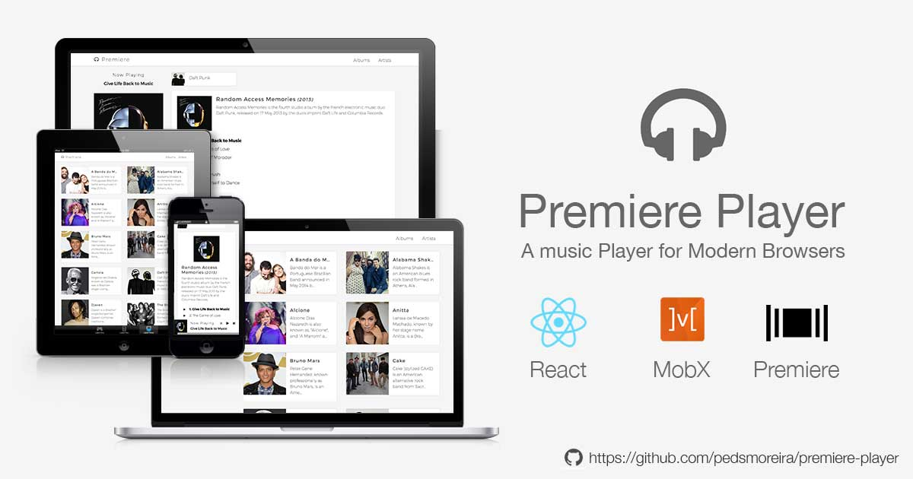

Premiere Player is a music player built with [Premiere](https://github.com/pedsmoreira/premiere), [ReactJS](https://facebook.github.io/react/) and [MobX](https://mobxjs.github.io/mobx/).

This is an experimental project. The music comes from Youtube iframes.

## Web App
This project can be added to the home screen of your mobile phone.
- Android: Open chrome, go to the [Premiere Player website](https://premiere-player.herokuapp.com/), click on `options` (icon on top right corner) and `Add to Home Screen` 

### Setup
- [Install NPM](https://www.npmjs.com/get-npm)
- Run `npm install`

* If you know what you're doing, I highly recommend you to use [Yarn](https://yarnpkg.com/), it's much faster than NPM

### Development
- Run development server `npm start` or `yarn start`

### Build
- `npm run build` or `yarn run build`

### Test
- `npm test` or `yarn test`

** The project has no tests at the moment
